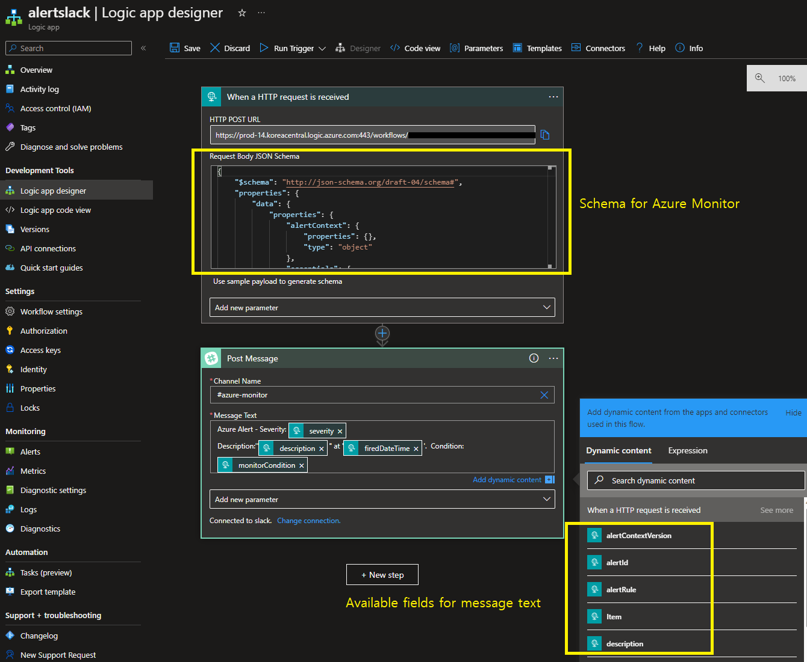

# Alert to Slack with Logic app

This code is forked from [Azure/azure-quickstart-templates](https://github.com/azure/azure-quickstart-templates/tree/master/demos/alert-to-slack-with-logic-app) which was not working now due to some wrong code snippet like using google api.
All wrong code snippets were modified and current schema of Azure Alert was applied to this template.

## Azure Alert common schema

* Azure Alert common schema is here: https://docs.microsoft.com/en-us/azure/azure-monitor/platform/alerts-common-schema-definitions
* Common schema for Logic App is here: https://learn.microsoft.com/en-us/azure/azure-monitor/alerts/alerts-logic-apps

   

This template allows you to create a Logic app that has a webhook to be used from an Azure Alert. When the Alert is triggered, it will post a message to a slack channel that you specify. You need to have a slack account to use this template.

## Authorizing with Slack

After the template deployment has completed, there is a manual step that you must complete before the messages can be posted to the channel. You have to log in to your Slack account via the Logic apps UI in order to consent to give Logic apps access to your Slack:

1. Once the template has completed, navigate to the resource group you deployed it to.
2. Find the Logic app in the resource list, and click it.
3. Select the **Edit** button in the command bar.
4. You'll now see the *Logic app designer* with "Connections" as being the last step.
5. Click "Connections".
6. Sign in, and acknowledge that Logic apps can access your account.
7. Click the Green checkmark at the bottom of the **Slack** card.
8. Click the Save button in the command bar.

## Test your Logic App for alerting to slack

1. Navigate to Azure Monitor and select **Alerts** then **Action groups**.
2. **Create** to crate action group and input the name of action group and etc.
3. Move to Notification tab and input proper values
4. Move to **Actions** that is the core of this template, and select **Logic App** in the dropdown list of Action type. Then you can choose the logic app that you created by this template.
5. Once create action groups, you can test it by clicking **Test** button in the action group. Slack channel will be notified

## Troubleshooting

* Don't forget to authorize slack connection in Logic App.
* Once the schema of Azure monitor is changed, you need to modify the schema of Logic App at ***Logic App Designer***. You have to change `Request Body JSON Schema` in `When a HTTP request is received` step. You can find the schema of Azure monitor at [Azure Monitor Common Schema](https://docs.microsoft.com/en-us/azure/azure-monitor/platform/alerts-common-schema-definitions)
* You have to change `Post Message` as well using **Dynamic Content**. Refer to the sample below.

`Tags: Microsoft.Web/connections, Microsoft.Logic/workflows, request, object, string, Http, ApiConnection`